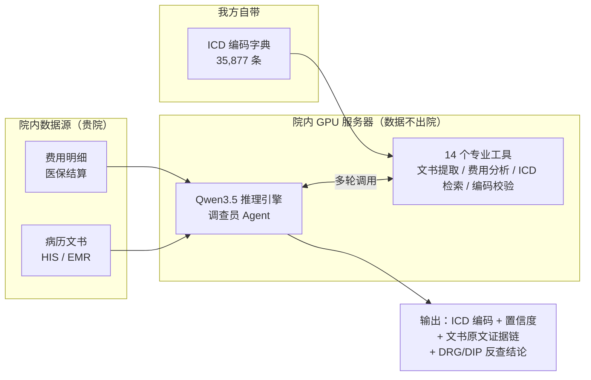
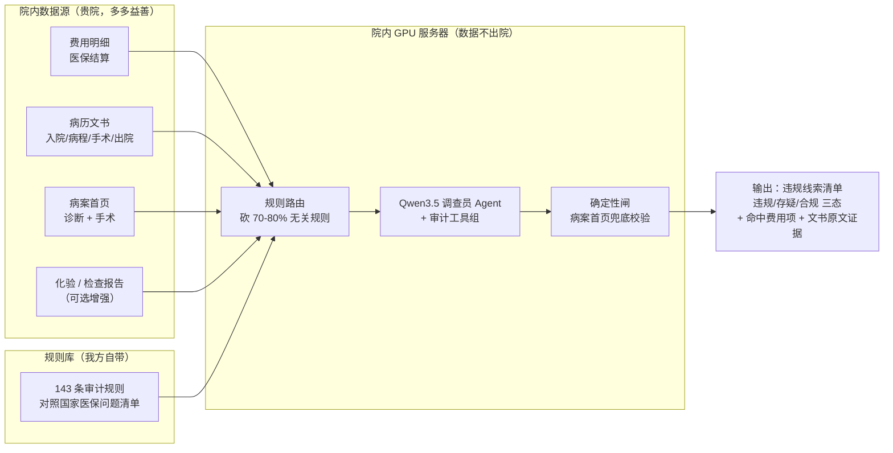
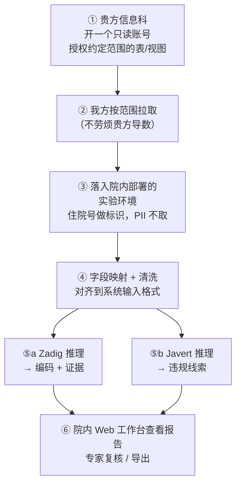

# Zadig 与 Javert —— 产品介绍与数据对接说明

> 面向：医院信息科 / HIS 厂商
> 用途：让对方一页纸看懂「这两个系统是做什么的、需要哪些数据、数据怎么流、需要什么配置」
> 阶段：**测试合作阶段**，详见第 1 节「合作前提」
> 版本：v1.0 ｜ 2026-06-10

---

## 0. 三十秒速览

| | **Zadig（扎第格）** | **Javert（沙威）** |
|---|---|---|
| **一句话** | AI 临床编码助手 | AI 医保违规自查助手 |
| **干什么** | 读病历 → 自动给出 ICD 诊断/手术编码 + 证据链；DRG/DIP 反查校验 | 读病历+费用 → 自动比对国家医保《自查自纠问题清单》→ 标出疑似违规收费 |
| **核心输入** | 病历文书 + 费用明细 | 病历文书 + 费用明细 + 病案首页（诊断/手术）+ 化验/检查 |
| **核心输出** | 编码建议 + 置信度 + 文书原文引证 | 违规线索清单（违规/存疑/合规三态）+ 命中证据 |
| **跑在哪** | 院内单台 GPU 服务器，**数据不出院** | 同上，两个产品共用一套院内 GPU 环境 |
| **给谁用** | 病案室、编码员、医保办 | 医保办、运营、纪检审计 |

> 两个产品是**互补**关系：Zadig 管「编码编得对不对」，Javert 管「钱收得合不合规」。共用同一套底层数据与同一台 GPU，所以对接一次数据、两个产品都能跑。

---

## 1. 合作前提（请先看这一节）

1. **测试合作阶段**：当前是用贵院真实数据做效果验证的实验阶段。
2. **不劳烦信息科/HIS 手动导数**：我们**不需要**贵方工程师专门为我们写脚本、跑导出。
   只需要贵方**开一个只读（read-only）权限的账号**给我们，**由我们自己按约定范围去拉取**数据。这样对贵方人力零占用。
3. **数据不出院**：系统**全部部署在院内**单台服务器上，模型在本地 GPU 运行，**零数据外传、不连公网大模型 API**。
4. **不需要病人隐私字段**：姓名、身份证号、住址、电话等 PII **一律不需要**。
   用**住院号 / 病案号**做唯一标识即可（这些字段在源数据里通常已涂黑或可脱敏）。
5. **为什么先要明确数据范围**：因为是「我们去拉」，所以需要贵方知道我们会读哪些表、哪些字段，便于贵方授权与审计。
   - 对 **Zadig**：范围聚焦（文书 + 费用即可起步）。
   - 对 **Javert**：**数据多多益善**——病历越完整，能自查的违规条目越多。完整范围见配套文件
     [`02_Javert数据范围清单.md`](./02_Javert数据范围清单.md)。

---

## 2. Zadig 是做什么的

### 2.1 定位

把一份住院病历，自动转成**规范的 ICD-10 诊断编码 + ICD-9-CM3 手术编码**，并且每个编码都附带「为什么这么编」的文书原文证据。同时支持 **DRG/DIP 反查**：外部分组器给的编码，系统独立复核给出「采纳 / 拒绝 + 证据」。

### 2.2 和「把病历丢给 ChatGPT」有什么不同

不是一次性问大模型要答案，而是让 AI 扮演**调查员**，像住院医一样**主动翻文书、查费用、交叉验证**，分多轮推理后才下结论：

```
① 制定调查计划（先看哪些文书、查哪些费用）
② 调用专业工具采集证据（文书诊断提取 / 费用信号分析 / 器官锚定 / ICD 检索 / 编码校验 …）
③ 综合证据 → 输出编码 + 置信度 + 完整证据链
```

**关键设计**：模型是「决策者」而非「知识库」——它不需要背下所有 ICD 编码，编码检索/手术识别/器官锚定由独立工具完成，模型只判断「证据够不够」「下一步查什么」。一个真实调查轨迹（甲状腺癌患者）：

```
Round 1  先查文书诊断 → note_diagnosis：「甲状腺恶性肿瘤」出现 7 次
Round 2  查费用验证   → fee_snapshot：手术费占比 15.7% ＋ surgery_gate：确认有手术证据
Round 3  调查具体术式 → surgery_investigate：单侧甲状腺部分切除术 ＋ organ_anchor：锚定甲状腺
Round 4  检索编码     → icd_lookup：C73.x00［精确匹配］＋ code_validate：校验通过
…Round 8 综合 8 轮证据 → 输出 5 个编码 ＋ 置信度 ＋ 完整证据链
```

四重约束防止模型「跑偏」：**① 流程分流**（按费用结构选调查流程，内科患者不会被安排手术编码检索）、**② 工具门控**（费用里没手术费就禁止输出手术编码，硬规则模型绕不过）、**③ 证据强制**（没有文书+费用双证据不出编码）、**④ 经验沉淀**（历史案例自动转成中文规则注入，越用越准，不改模型本身）。

> 越用越准实测（30 例测试集 × 3 轮自动进化）：综合评分 70.3→81.1；诊断精确匹配 53%→74%；手术精确匹配 17%→64%。

### 2.2.1 Zadig 的 14 个专业工具

| 类别 | 工具 |
|------|------|
| 分流 | `recipe_select` 按费用结构选调查流程 |
| 文书取证 | `note_diagnosis` 文书诊断提取＋频次 · `search_notes` 文书全文检索 |
| 费用取证 | `fee_snapshot` 费用结构摘要 · `fee_signal` 费用信号分析 · `search_fees` 费用全文检索 |
| 手术识别 | `surgery_investigate` 术式识别 · `surgery_gate` 手术门控 · `surgical_code_fallback` 手术编码兜底 |
| 定位/冲突 | `organ_anchor` 器官锚定 · `conflict_detect` 费用-文书冲突检测 |
| 编码 | `icd_lookup` ICD-10/9 检索（35,877 条库）· `code_validate` 编码校验 |
| 药品 | `drug_indication` 药品适应症核查 |

### 2.3 Zadig 需要的数据

| 数据 | 说明 | 来源 | 谁提供 |
|------|------|------|--------|
| **病历文书** | 入院记录、病程、手术记录、病理、出院小结等文本 | HIS / EMR | **贵院** |
| **费用明细** | 每笔收费一行（医保结算明细） | 医保结算 / HIS | **贵院** |
| ICD 编码字典 | 35,877 条 ICD-10 + ICD-9 标准库 | —— | **我方自带**，无需贵院提供 |

> Zadig 起步只需上面两类院方数据。字典是我们自带的标准库。

### 2.4 Zadig 数据流向



---

## 3. Javert 是做什么的

### 3.1 定位

对照国家医保局 2026《医疗机构自查自纠问题清单》，把病历 + 费用喂进去，**自动逐条扫描疑似违规收费**：重复收费、过度检查、超标准收费、串换项目、虚记多记、药品超适应症等。每条线索给出「**违规 / 存疑 / 合规**」三态判定 + 命中的费用项与文书原文。

> 通俗讲：它是一个**不知疲倦的医保自查员**，在医保飞检来之前，先把你们自己的账过一遍，把站不住脚的收费挑出来。

### 3.2 怎么判的

每条规则是一个 YAML 文件 + 一段审计逻辑。系统先用**规则路由**砍掉 70–80% 明显不相关的规则（省算力），再让 AI 调查员调用工具取证：

```
费用里查到「项目 A」+「附属项 B」并存，且文书里没有正当理由 → 命中「重复收费」
检查类费用命中，但诊断里查不到对应指征 → 命中「过度检查」
诊断只是小病，费用里却出现大手术 → 命中「串换 / 虚记」
```

判定结果落库前，再过一道**确定性闸**（拿病案首页的真实手术/诊断做兜底校验，**只降不升**），把站不住脚的「误报」降级，保证报给专家的线索质量。

**三态判定**：违规（证据确凿）/ 存疑（需人工复核）/ 合规（无问题）。LLM 必须输出**结构化结果**而非自由文本，保证可机读、可统计、可逐条溯源到费用项与文书原文。

### 3.2.1 Javert 的 10 个审计工具

| 类别 | 工具 |
|------|------|
| 文书 | `search_notes` 文书检索 · `note_diagnosis` 病案首页诊断提取 · `scan_progress_indications` 病程指征扫描 |
| 费用 | `search_fees` 费用明细检索 |
| 药品 | `drug_indication` 药品适应症核查 · `drug_audit_lookup` 药品违规库查询（928 通用名监管 KB） |
| 化验/检查 | `search_lab_results` 化验检索 · `search_examinations` 检查检索 |
| 麻醉/病理 | `search_anesthesia` 麻醉检索 · `search_pathology` 病理检索 |

### 3.3 Javert 需要的数据

Javert 当前已能直接使用的 **4 类核心数据**：

| 数据 | 说明 | 用途 |
|------|------|------|
| **费用明细** | 每笔收费一行（医保结算明细） | 所有违规判定的钱侧依据 |
| **病历文书** | 入院/病程/手术/出院等文本 | 找「有没有正当理由 / 指征」 |
| **病案首页-诊断** | 主诊断/其他诊断（带 ICD 码） | 判过度检查、串换的诊断侧基准 |
| **病案首页-手术** | 手术/操作（带 ICD-9-CM3 码） | 判手术真实性、手术对应收费 |

**可选增强（已支持）**：化验报告、检查报告 —— 接进来后能多审一批「无指征化验/检查」类规则。

> **关键原则：对 Javert，数据多多益善。** 病历给得越全（医嘱、麻醉、护理、知情同意、植入器械……），能覆盖的违规条目越多。
> 完整的「希望拿到的数据范围」清单见 → [`02_Javert数据范围清单.md`](./02_Javert数据范围清单.md)。

### 3.4 Javert 数据流向



---

## 4. 数据接入方式（测试阶段怎么落地）

整体逻辑：**贵方开只读权限 → 我方自取 → 落入院内实验环境 → 院内 GPU 推理 → 产出报告**。全程数据不出院。



**对接所需的最小动作（贵方侧）**：

1. 开一个 **只读账号**，授权我们读取约定范围的费用/文书/病案首页（Javert 另需化验/检查及更多文书表，越全越好）。
2. 告知我们这些数据**在哪个库/哪些表/字段叫什么**（HIS 原始列名即可，列名不一致我方自行映射，不用贵方改名）。
3. 其余——拉取、脱敏、字段对齐、部署、推理——**全部由我方完成**。

> 数据规格细节（每张表的必填字段）见配套文件 [`02_Javert数据范围清单.md`](./02_Javert数据范围清单.md) 及项目内 `docs/数据接入清单.md`。
> 若直连库不方便，也支持贵方把数据按模板填入约定的几张中转表，我方从中转表取数（兜底通道）。

---

## 5. 需要什么配置 / 吃多少资源

两个产品**共用同一套院内 GPU 环境**，底层都是本地部署的 Qwen3.5-35B 大模型（4bit 量化，约 18GB 显存）。对接一台机器即可同时支撑两个产品。

### 5.1 硬件配置与吞吐

| 硬件配置 | 单患者耗时 | 并发 | 日吞吐·Zadig编码（8h） | 适用场景 |
|---------|-----------|------|-------------|---------|
| **当前测试环境：RTX 5880 Ada 48GB ×1** | 2–5 分钟 | 1 路 | ~100–150 例 | 开发验证 / 测试合作 |
| A100 80GB ×1 | 1–2.5 分钟 | 2 路 | ~400–500 例 | 中型综合医院 |
| **H100 80GB ×2** | **0.8–1.5 分钟** | **4 路** | **~1,200–1,500 例** | 大型三甲日常 |
| H100 80GB ×4 | 0.8–1.5 分钟 | 8 路 | ~2,500–3,000 例 | 大型三甲 + 历史回溯 |

> **选型建议**：日均出院 200 例以内，1 张 A100 足够；日均 500 例以上，建议 2× H100（性价比最优起步配置）。
> **测试阶段**：一张 48GB 卡即可跑通完整流程（具体该向贵院申请哪档，见 §5.4.1「该向贵院申请什么 GPU 配置」）。

> 🧮 **拇指法则（估吞吐用这条，别用显存估）**：**吞吐由「卡的数量 × 卡的速度」决定，不由显存大小决定。**
> - 一张卡 ≈ 一条饱和的推理流水线。单卡实测：**Zadig ~12–20 例/时，Javert ~5–8 例/时**。
> - 公式：**日吞吐 ≈ 卡数 × （每天工时 × 60）÷ 单病人分钟数**。例：2 卡 × 8h×60 ÷ 4 分钟 ≈ 240 例/天（Zadig）。
> - 要更高吞吐 → **加卡**（多流并行，吞吐近线性涨）或**换更快的卡**（H100 缩短每病人耗时）；单纯加显存**不会**让单卡更快。
> - 显存只是「装得下模型 + 检索模型」的门槛（~24–32GB 起步，48GB 舒服）；越过门槛后再大也不直接加吞吐。

### 5.1.1 为什么一张 48GB 卡几乎被占满？（澄清常见误解）

> ❗ **占满 ≈90% 显存是推理框架 sglang「主动预留」的结果，不是这个 8K 上下文的模型真的需要这么多。** 模型本体（4-bit 量化）只占 ~18–20GB；剩下的 ~20–25GB 是 sglang 启动时一次性圈下来的 KV 缓存池（由 `--mem-fraction` 决定，**与上下文长度无关**），目的是最大化并发吞吐。即使 0 请求，`nvidia-smi` 也显示占用。

模型 `Qwen3.5-35B-A3B-GPTQ-Int4` —— 混合架构 MoE（35B 总参 / 仅 ~3B 激活）。关键架构参数（HuggingFace 官方 config）：

| 参数 | 值 | 含义 |
|------|----|------|
| `num_hidden_layers` | **40** | 每 4 层一组：3 层线性注意力(GatedDeltaNet) + 1 层标准注意力 → 仅 **10 层**有增长型 KV cache |
| `hidden_size` | 2048 | 模型维度 d |
| `num_attention_heads` | 16 | query 头数 |
| `num_key_value_heads` | **2** | GQA — 只有 2 个 KV 头（KV cache 小的关键） |
| `head_dim` | 256 | 每头维度 |
| experts | **256 选 8** + 1 shared | MoE：256 专家全驻留，每 token 激活 8 个 |
| `moe_intermediate_size` | 512 | 每专家 FFN 中间维度 |
| `vocab_size` | 248,320 | 词表 |
| `max_position` | 262,144 | 模型上限；本部署只服务到 **8K** |

**详细显存计算公式（工程向）**：

**① 模型权重**（显存大头，与上下文无关）：

```
权重显存 = 总参数量 × 每权重比特数 ÷ 8
  纯 4-bit 下限 = 35e9 × 4 ÷ 8 = 17.5 GB
  + GPTQ group-128 scales/zeros (≈4.5 bpw) + bf16 embedding → ≈ 18–20 GB
```

> 🧠 **MoE 关键**：256 个专家权重**必须全部驻留显存**，哪怕每 token 只激活 8 个。A3B 的「3B 激活」只决定算力/速度，不减显存——所以「3B 激活」的模型显存吃起来仍像 35B。

**② KV cache**（随上下文增长，但因混合架构极小）：

```
# 仅 10 层标准注意力有 KV cache；30 层 GatedDeltaNet 是固定状态(与长度无关)
每 token = L_full × 2(K+V) × h_kv × d_head × 字节
        = 10 × 2 × 2 × 256 × 2(bf16) = 20,480 B ≈ 20 KB/token
单条满 8K 序列 = 20,480 × 8192 ≈ 160 MB
```

→ 即使塞满 8K，单序列 KV 也只 ~160MB。**上下文长度根本不是吃显存的主因。**（同上下文的 dense 32B 约 2GB/序列，混合架构小一个数量级。）

**③ sglang 预留池**（**这才是「占满 48GB」的真身**）：

```
# sglang 启动时按 mem-fraction 一次性圈走显存做 KV 池
KV 池 = GPU总显存 × mem_fraction − 权重 − 框架开销
      = 48 × 0.9 − 19 − 3 ≈ 21 GB
最大并发 = 21e9 ÷ 20,480 ≈ ~100 万 token  (跨所有并发序列总和)
```

这块在启动时就预留好，0 请求也显示占用。它换来的是「能同时塞多少并发/多长上下文」——是为吞吐换的，不是模型刚需。

**汇总（48GB 卡，mem_fraction=0.9）**：

| 组成 | 大小 | 随什么变 |
|------|------|---------|
| 模型权重（4-bit，35B / 256 专家全驻留） | ~18–20 GB | 模型大小，**与上下文无关** |
| KV cache 池（sglang 预留） | ~20–25 GB | `--mem-fraction`，**不是**上下文长度 |
| CUDA graph + 激活 + context | ~2–4 GB | batch / 图捕获配置 |
| **合计** | **~43–45 GB** | ≈ 0.9 × 48 |

> 🎛️ **可调**：想腾显存 → 调低 `--mem-fraction-static`（如 0.7 → 占 ~34GB），代价是 max_total_tokens↓ → 并发/吞吐↓。模型跑起来的**最低**需求仅 ~20GB 权重 + 几 GB，所以一张 24GB 卡也能跑单路推理。

### 5.2 性能实测（单患者）

**Zadig 编码**（一个病人跑一遍编码）：

| 患者 | 文书条数 | 费用条数 | 推理轮数 | 工具调用 | 耗时 |
|------|---------|---------|---------|---------|------|
| 甲状腺癌 | 152 | 117 | 8 轮 | 23 次 | ~4.5 分钟 |
| 脑干占位 | 160 | 1,235 | 4 轮 | 12 次 | ~2.5 分钟 |
| 骨科 | 131 | 177 | 5 轮 | 21 次 | ~1.8 分钟 |

**Javert 审计**（一个病人要跑多条规则，每条是独立 mini 推理，故更慢）：

| 场景 | 规则数 | 并发 | 单患者耗时 |
|------|-------|------|-----------|
| 单模板（M1 重复收费） | 15 条 | 5 | ~4–6 分钟 |
| 全量审计（Router 剪枝后） | ~8–35 条 | 5 | ~6–12 分钟 |
| 批量实测（50 病人 / 8.7 小时） | — | — | ~10 分钟/病人 均值 |

**两产品吞吐对比（同一张 48GB 卡）**：

| 产品 | 每病人模型工作量 | 单患者耗时 | 日吞吐（8h / 全天 24h） |
|------|-----------------|-----------|------------------------|
| **Zadig 编码** | 1 遍 agent loop（4–8 轮，~17 工具调用） | 2–5 分钟 | ~100–150 / ~300–450 例 |
| **Javert 审计** | Router 剩 ~8–35 条规则，每条一个 mini agent loop | ~6–12 分钟 | ~40–60 / ~120–180 例 |

> ⚖️ Javert 比 Zadig 慢，是因为一个病人要跑多条规则（每条独立推理），而 Zadig 一个病人只跑一遍编码。两产品**共用一张卡时是分时跑、不叠加**。

### 5.3 为什么不能「秒出」

每个患者不是一次模型调用，而是 4–8 轮**多步推理**：读真实文书原文 → 调工具交叉验证 → 决定下一步查什么。慢一点，但**每个结论都有完整证据链**——这正是医保审核/编码复核需要的，也是和「把病历贴进通用大模型问一句」的本质区别。

### 5.4 整机配置建议（单台推理服务器）

| 部件 | 测试 / 起步 | 说明 |
|------|-----------|------|
| **GPU**（决定速度，钱花这） | 1× 48GB（如 RTX 5880 Ada） | 跑大模型本体（~18GB）+ 并发；显存越大并发越高 |
| **CPU** | ≥ 8 核（推荐 16 核） | 数据加载、工具执行、Web 服务；常规即可，不需顶配 |
| **内存 RAM** | ≥ 32GB（推荐 64GB） | 装载 ICD 字典 / 向量库 / 病历快照 |
| **硬盘 SSD** | NVMe ≥ 512GB（推荐 1TB） | 模型权重 ~20GB + 字典 / 向量库 + 病历数据 + 结果库 |
| **网络** | 仅院内内网 | 不需要也不会连公网 |

> **一句话**：钱花在 GPU 上，CPU / 内存 / 硬盘都是常规服务器规格即可——够用就行，不是越贵越好。

### 5.4.1 该向贵院申请什么 GPU 配置？

系统部署在院内单台服务器，GPU 是唯一关键件。三档供选（贵院若有现成资源，可就高申请）：

| 档 | 显存 | 能不能跑 · 吞吐含义 |
|----|------|--------------------|
| **最小可实现** | 单卡 **24GB**（如 RTX 4090 / A10） | ✅ 能跑。模型本体（~20GB）刚好装下，检索模型挤到 CPU、并发≈1 路。pilot 体量（每天几十例）够用，但没余量 |
| **推荐** | 单卡 **48GB**（如 RTX 5880 Ada） | 👍 LLM + 检索模型都上 GPU + 留并发余量，跑得稳。当前测试环境就是这档 |
| **更高 / 放量** | **80GB** 数据中心卡（A100 / H100） | 🚀 主要换来**更快的芯片**（显存带宽 2–3× → 每病人更快）+ 更高并发，适合日均数百例 |

> ⚠️ **两个常见误解（开口要配置前先看）**
> - **「用 24GB 而不是 48GB，会限制日吞吐吗？」** —— 在**同一块芯片**上，24GB 与 48GB 的**单卡吞吐差不多**，因为瓶颈是芯片算力/带宽 + 多轮串行推理，**不是显存**。24GB 的真实限制是：检索模型抢显存、几乎没有并发余量（而不是吞吐被砍半）。
> - **「显存从 48GB 给到 80GB，吞吐是不是 ×2？」** —— **不能这么估**。显存翻倍 ≠ 吞吐翻倍：多出的显存只是能多塞几路并发，吞吐有提升但**次线性**、且会被芯片算力封顶。真正让吞吐翻倍的是**换更快的芯片**（A100/H100 带宽 2–3×）或**加卡**。
> - 👉 **一句话：显存看「够不够装下 + 留余量」（48GB 推荐），吞吐看「芯片多快 / 几张卡」。要更高吞吐就申请数据中心卡或多卡，而非单纯堆显存。**

**📈 显存带宽 → 吞吐提升（为什么换卡能更快）**：LLM 逐字生成（decode）的速度由**显存带宽**决定——每生成 1 个 token 都要把模型权重从显存读一遍。换更高带宽的卡，**每病人耗时近似按带宽比缩短**：

| GPU | 显存 / 带宽 | 带宽 vs 当前 | 预计单卡吞吐提升 * |
|-----|------------|-------------|-------------------|
| **RTX 5880 Ada**（当前） | 48GB GDDR6 / **0.96 TB/s** | 1× | 基准（Zadig ~12–20 例/时） |
| **A100 80GB** | 80GB HBM2e / **2.04 TB/s** | **~2.1×** | **~1.7–2×** |
| **H100 SXM** | 80GB HBM3 / **3.35 TB/s** | **~3.5×** | **~2.5–3×**（+ FP8 / 更高并发再加） |

> \* 单卡单流估算。生成（decode）占单患者耗时约 **85%** 且受带宽限制，工具执行那 ~15% 不随带宽变——故吞吐提升**略低于带宽倍数**（≈ 带宽比 × 0.85）。多卡再 × 卡数。带宽为 NVIDIA 官方规格（SXM 版）。

### 5.5 软件环境

| 项 | 要求 |
|----|------|
| 部署形态 | 院内单机，Docker 容器 |
| 操作系统 | Linux（Ubuntu / CentOS 均可） |
| GPU 软件栈 | NVIDIA 驱动 + CUDA（详见交付时环境清单） |
| 数据库 | 结果存本地（测试阶段 SQLite 即可自洽；正式可对接院内 SQL Server） |
| 对外端口 | 一个院内 Web 工作台端口（专家复核用） |

---

## 6. 给信息科的一页纸 · 行动清单

| # | 事项 | 谁做 |
|---|------|------|
| 1 | 提供一个**只读账号**，授权读取约定范围数据 | 贵方信息科 |
| 2 | 告知数据所在库/表/字段（HIS 原始列名即可） | 贵方信息科 |
| 3 | 确认数据范围：Zadig=文书+费用；Javert=见 `02_Javert数据范围清单.md`（多多益善） | 双方确认 |
| 4 | 部署一台 GPU 服务器（测试阶段一张 48GB 卡即可） | 双方协调 |
| 5 | 拉数 / 脱敏 / 映射 / 部署 / 推理 / 出报告 | **我方** |

**承诺**：数据不出院 · 不取隐私字段 · 不占用贵方导数人力。

---

*Zadig（扎第格）取自伏尔泰同名小说主人公——靠观察细节推断真相的智者；Javert（沙威）取自《悲惨世界》中那位一丝不苟、绝不放过任何疑点的警探。一个负责「编得对」，一个负责「收得正」。*
