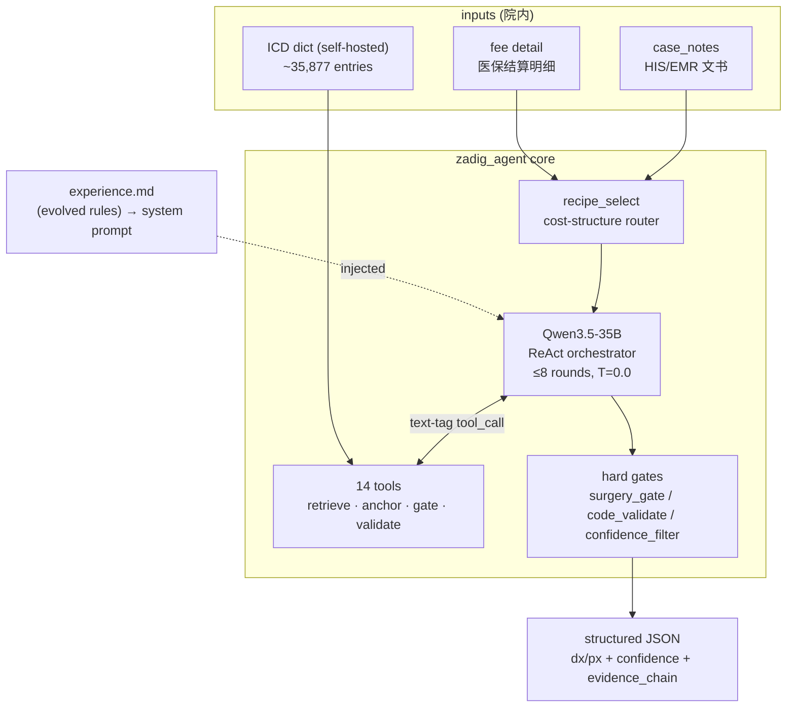
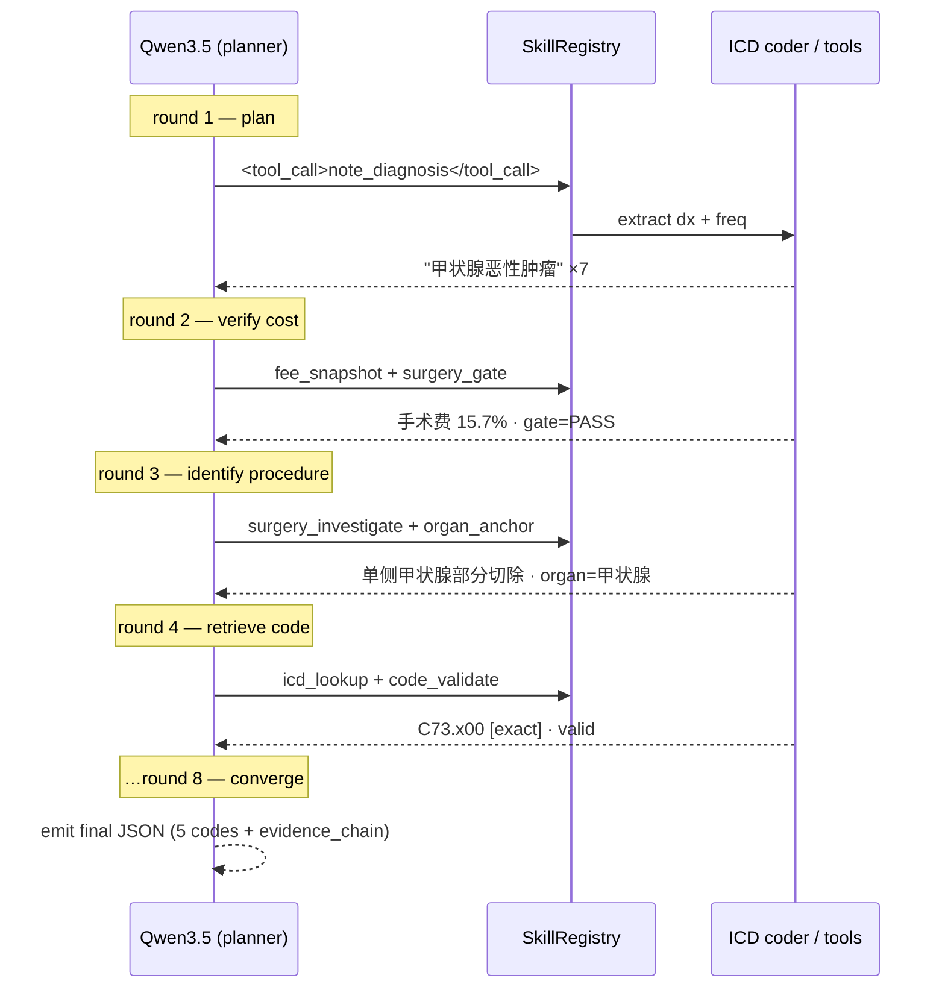
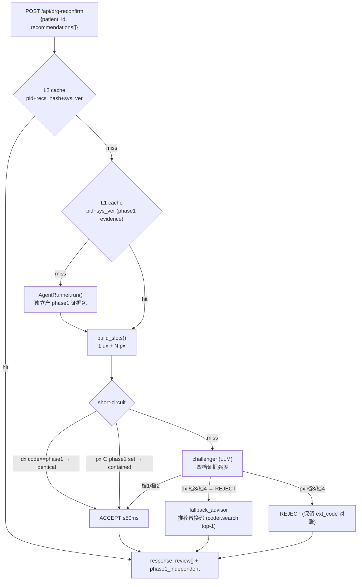
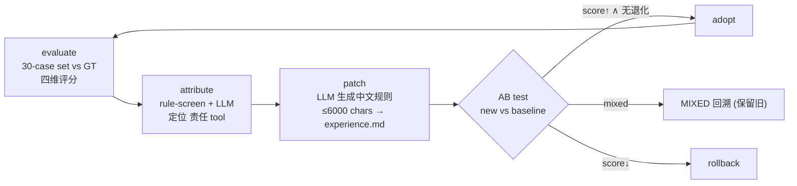
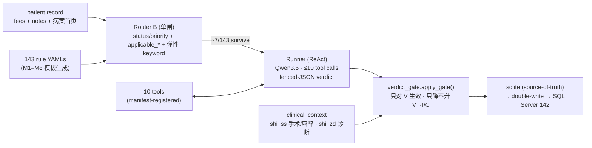

# Tech Deep-Dive · Zadig & Javert

> 面向 AI 工程师的架构复盘 · agentic clinical-coding & rule-based audit pipelines · 自用技术参考
> 本文是 `技术深潜_Zadig与Javert.html` 的 markdown 底稿（同步内容，便于 git-diff / 复制）。
> 版本：v1.0 ｜ 2026-06-10

> **诚实声明**：模型/loop 上限/工具清单/gate 逻辑/reconfirm 四档/缓存机制均从两个 codebase 实际读出。
> 少数**具体魔数**（icd_lookup RRF 权重 0.7/0.3、细码 boost 1.1、fee 阈值等）系从 CLAUDE.md / 代码推断，标 `~`/`e.g.` 为近似；正式对外前建议核源码。

---

# Tab 1 · zadig_agent

| domain | paradigm | llm | killer feature |
|--------|----------|-----|----------------|
| Clinical Coding（ICD-10 dx + ICD-9-CM3 px） | ReAct Agent（tool-calling, 多轮证据收集） | Qwen3.5-35B（GPTQ-Int4 · sglang） | DRG/DIP Reconfirm（independent verifier + 证据链） |

## §1 系统总览

Zadig 的定位是 **agentic clinical coder**：给定一份住院病历（文书 + 费用），输出结构化的 `main/secondary diagnosis` + `main/secondary surgery` + 每码的 `confidence` + `evidence_chain`。核心是一个受约束的 **ReAct loop**——LLM 作 orchestrator/decision-maker，专业能力（检索、识别、锚定、校验）全部外置为确定性 tools。

> **core thesis** — 把 LLM 当 **policy / planner** 而非 knowledge base。它不背 ICD 码，只决定「证据够不够」「下一步 call 哪个 tool」。所有事实性输出都必须 grounded 在 tool 返回的证据上 + 过硬 gate。



## §2 LLM backend & inference

| 项 | 值 / 机制 |
|----|-----------|
| model | **Qwen3.5-35B-A3B-GPTQ-Int4**（4-bit weight-only quant，~18GB VRAM footprint） |
| serving | **sglang** OpenAI-compatible server · `http://192.168.31.62:30000/v1` · RadixAttention KV-cache reuse |
| client | `httpx` 同步直连 `/v1/chat/completions`（绕开 OpenAI SDK 在 Windows 上的 hang） |
| sampling | `temperature=0.0`（greedy，求 determinism）· `max_tokens=8192` · `enable_thinking=false` |
| tool protocol | **text-tag，非 native function-calling**：模型吐 `<tool_call>…</tool_call>`，registry 正则 parse + dispatch |
| robustness | `content` 空时 fallback 到 `reasoning_content`；截断 JSON 走 `_partial_repair_truncated()` 正则抽字段 |

> **design rationale** — 选 text-tag 而非 OpenAI `tools=[]`：对 Qwen3.5 实测更稳、token 更省，且 parser 自己可控（可加 repair / 多 tag 容错）。`T=0.0` 是医保审计场景的硬约束——同一病人两次必须同结果（reproducibility > diversity）。

## §3 Agentic loop（ReAct，≤8 rounds）

每个 patient 不是 single-shot，而是 plan → act → observe 的多轮 trajectory。第 N 轮的 plan 依赖第 N-1 轮的 observation，因此本质 **串行**（这也是单 patient 延迟有下界的根因）。



| 机制 | 说明 |
|------|------|
| MAX_ROUNDS | 8。超出 → deadline turn 强制 emit final JSON |
| convergence | 当某轮所有 `tool_call` 全部 cache-hit（无新证据）→ 判定收敛，强制请求最终 JSON |
| cache | per-tool result cache，key=`name+args`；同键至多执行一次（跨轮 memo） |
| token logging | 每轮记 `prompt/completion_tokens` 进 `trace`，供 cost attribution |

## §4 Recipe routing（cost-structure prior）

`recipe_select` 先看费用结构，把患者分流到不同 tool-chain。本质是 **policy prior**：避免内科患者也去跑手术编码检索，降噪 + 省轮次。

| recipe | trigger（费用结构） | mandatory tools |
|--------|--------------------|-----------------|
| **外科** | 手术费占比 > 阈值 / 多项手术费 | note_diagnosis · fee_signal · surgery_gate · surgery_investigate · organ_anchor · icd_lookup |
| **内科** | 单药占比高 + 无手术费 | fee_signal · drug_indication · note_diagnosis · icd_lookup · conflict_detect |
| **肿瘤** | PD-1 / 化疗 / 靶向 + 病理 | note_diagnosis · drug_indication · organ_anchor · icd_lookup |
| **标准** | default fallback | note_diagnosis · fee_signal · icd_lookup |

## §5 Tool suite（14 tools）

| tool | function |
|------|----------|
| `recipe_select` | cost-structure → tool-chain prior（DIP index 反向索引） |
| `note_diagnosis` | 文书 dx 提取 + 频次；子阶段 white/black/grey-list 降噪（黑名单"鉴别诊断/术前讨论"不计频次） |
| `fee_snapshot` | 费用结构摘要 + high-cost-drug 检测 + 手术费占比 → recipe signal |
| `fee_signal` | global-IDF + organ-PMI 双层信号（费用项的判别力加权） |
| `search_notes` | 文书全量检索（dir / section / keyword 三模式） |
| `search_fees` | 费用全量检索（agg / category / keyword） |
| `surgery_investigate` | 术式识别 + procedure 原文摘录（v2.4 合并 note_parse + detect） |
| `surgery_gate` | **hard gate**：费用无手术费 ∧ 文书无手术子阶段 → 手术码强制置空 |
| `surgical_code_fallback` | 手术码兜底（识别到术式但 icd_lookup miss 时） |
| `organ_anchor` | patient-level 器官锚定，多源加权投票（手术/费用/出院诊断/主诉） |
| `conflict_detect` | fee↔note 语义冲突检测（类型 / 严重度 / resolution） |
| `icd_lookup` | hybrid retrieval + rerank + KG prior（详见 §6） |
| `code_validate` | 复合码 `+` / 星号码 `*` 不可独立作主诊 / 格式校验 |
| `confidence_filter` | CCI 动态阈值，conf < 0.7 标「需人工确认」 |

## §6 `icd_lookup` — hybrid retrieval pipeline

这是系统里最重的检索组件：在 ~35,877 条 ICD-10/9 上做 **hybrid dense+sparse retrieval → cross-encoder rerank → knowledge-graph prior → 细码 boost**，最后给每个候选打 match-tier 标签并强制 exact-match。

1. **recall** — Dense（`BGE-small-zh-v1.5` bi-encoder, top-50）∥ BM25（分 batch 绕 SQLite 变量上限）
2. **fuse** — RRF / 加权融合（dense ≫ sparse，e.g. 0.7/0.3）
3. **rerank** — Cross-Encoder（`BGE-reranker-v2-m3`, top-5）
4. **consistency check** — 器官差异 / 操作方式关键词一致性校验
5. **KG / Bayesian prior** — surgery prior + organ 约束 + 继发肿瘤 `C79.*` boost
6. **fine-code boost** — 细码优先（boost ~1.1，coarse 轻罚）
7. **tag** — `[exact]`≥0.85 / `[close]`≥0.7 / `[reference]`≥0.5 / `[weak]`

> **[exact] enforcement** — 当 `icd_lookup` 返回 `[exact]`（match_score≥0.85），system prompt 硬约束 LLM **必须采用**该码，禁止以「更具体/更精确」为由覆盖。这条规则是 v2.5 修的一个真实 bug——模型爱「自作聪明」改码。

match_score 阶梯：exact 1.0 → contain 0.85 → core_align 0.7 → overlap 0.5 → weak 0.3；final = search×0.2 + match×0.8。

## §7 Structured output & anti-hallucination

```jsonc
// 强制输出 schema (无效则 repair → 二次失败降级)
{
  "main_diagnosis": { "code", "name", "confidence": 0..1, "reasoning" },
  "secondary_diagnoses": [ … ],
  "main_surgery": { "code": "ICD-9 | null", … },
  "secondary_surgeries": [ … ],
  "evidence_chain": [ "证据1: …", "证据2: …" ]  // 必须非空
}
```

| 层 | 机制 |
|----|------|
| recipe 分流 | tool-chain prior，降低 search space → 减幻觉面 |
| hard gate | `surgery_gate` / `code_validate`：硬编码规则，LLM 绕不过 |
| evidence grounding | 每码必须挂 note+fee 双证据；`evidence_chain` 空 → 拒绝出码 |
| confidence floor | conf < 0.7 → 标「需人工确认」，不当成定论 |
| output repair | JSON parse fail → fenced-block 提取 → 正则 partial-repair → 仍失败转降级 |

## §8 DRG/DIP Reconfirm pipeline（killer app）

独立于正向编码的一条线：外部 grouper 推荐的 dx/px 码，系统 **零感知地**用病历独立复核，输出 `ACCEPT/REJECT` + 文书原文引证（可直接做医保抗辩材料）。这是把 agent 当 **independent verifier** 用。



### challenger — 四档证据强度（four-tier evidence rubric）

| 档 | 判据 | decision |
|----|------|----------|
| **档1** | 文书有同义/同族明确诊断或操作记录（note 命中 / 病理 / 原文片段） | ACCEPT |
| **档2** | 同章节但不同亚目的明确诊断（同 C 章淋巴瘤亚目差异） | ACCEPT |
| **档3** | 性质冲突（良性 vs 恶性 / 活检 vs 切除） | REJECT |
| **档4** | 文书完全无相关信号（0 命中） | REJECT |

> **why de-anchor phase1** — v2.11.0 把 `phase1_code/name/reasoning` 从 challenger prompt 里**删掉**了。原因：传 phase1 会让 LLM 被自家正向编码的错答**锚定**（J18906 因「鉴别诊断」字面频次误判 SAH）。让 challenger 只看文书事实做独立判断，REJECT 后再由 `fallback_advisor` 单独推替换码。

| 组件 | 机制 |
|------|------|
| short-circuit | `identical`（dx 严格相等）/ `contained`（px ∈ phase1 集合）→ 跳过 LLM，≤50ms |
| note_filter | 子阶段 white/black/grey-list；黑名单段不进证据频次（修字面频次污染） |
| fallback_advisor | dx REJECT 后单次轻量 LLM（max_tokens=512, ≤15s）推诊断名 → `coder.search` top-1 得替换码 |
| decision (二态) | `ACCEPT` / `REJECT`（v2.7 删掉 REPLACE 三态） |
| decision_reason | `identical · contained · llm_accept · llm_reject · degraded` |
| L1/L2 cache | key 含 `system_version`=SHA256(核心文件)[:12]；改任一 reconfirm 文件 → 缓存自动失效 |

cached reconfirm <200ms；px hash 对 surgery 顺序无关（排序后哈希），命中后按请求顺序重排。

## §9 Evolution loop（self-improving，不动权重）

不 fine-tune，而是把失败 case 沉淀成自然语言规则注入 system prompt。本质是 **prompt-space 的 closed-loop optimization + AB-gated 采纳**。



| gear | 主要改动 | 综合 | dx P | px P |
|------|---------|------|------|------|
| v0 (v2.2) | seed baseline | 70.3 | 53% | 17% |
| gear2 (v2.4) | tool_gap 修复（10→14 tools） | 75.7 | 57% | 62% |
| gear3 (v2.5) | retrieval bugfix ×3 + 同义词扩展 | 81.1 | 74% | 64% |

> **empirical takeaway** — 真正的阶跃来自 **tool bugfix**（手术 P 17%→62% 是补了 `surgery_investigate`），而 experience 进化呈**对数收敛**（+5 → 振荡 → stagnation）。结论：先修 tool capability gap，再谈 prompt 进化。

## §10 Deployment & API

| 项 | 值 |
|----|-----|
| image | `zadig_agent_api:2.11.0`（multi-stage, py3.11 + uv + ODBC18）· cold start ~210s（embedding+reranker 加载主导） |
| sync API | `POST /api/drg-reconfirm` → review[] + phase1_independent |
| async API | `GET /api/drg-reconfirm/audit/by-request/{request_id}` 轮询（缓解 client read-timeout，长尾可达分钟级） |
| audit | SQL Server 审计表 + 3 只读查询路由（by-patient / audit_id / list） |
| patient_id normalize | 正则兼容 `H-X` / `H31010600042-X` 等院方前缀（曾因 normalize 漏配致批量 false REJECT） |

> **prod incident** — 对接方 Hutool client read-timeout（默认 60s–3min）远低于服务端长尾（`note_diagnosis` 可 6 min + `coder.search` 串行）→ client 报「卡 3.5h」但服务端早 200。修法：client timeout ≥15min 或改 async 轮询。

---

# Tab 2 · javert

| domain | paradigm | llm | killer feature |
|--------|----------|-----|----------------|
| Insurance Audit（医保违规自查） | 2-layer（Router prefilter + ReAct agent） | Qwen3.5-35B（GPTQ-Int4 · sglang 共享） | Deterministic gate（病案首页 ground-truth 驳幻觉） |

## §1 Two-layer architecture

Javert = **Router B（确定性 prefilter）** + **Runner（LLM agent）** + **verdict_gate（确定性后置闸）**。规则即文件（143 条 YAML），LLM 只跑 router 留下的子集，裁决落库前再过 gate。三态裁决 `VIOLATION / INCONCLUSIVE / CLEAN`。

> **core thesis** — 把「能确定性判的」全部从 LLM 手里拿走：**前置** router 用 keyword/applicable 砍掉 70–80% 无关规则（省 GPU），**后置** gate 用病案首页硬事实把 LLM 的假阳性 **只降不升**地纠回。LLM 只做中间那段「读文书+费用判有无指征」的软判断。



## §2 LLM backend

与 zadig_agent **共享同一套 inference stack**（同模型、同 sglang endpoint），代码层从 zadig_agent v2.10.1 拷贝（非 PyPI 依赖，手动 cherry-pick 同步）。

| 项 | 值 / 机制 |
|----|-----------|
| model / serving | Qwen3.5-35B-GPTQ-Int4 · sglang `192.168.31.62:30000` · `httpx` 同步直连 |
| sampling | `temperature=0.0` · `max_tokens=8192` · timeout 300s · retry budget 3（指数退避） |
| tool protocol | `<tool_call>{json}</tool_call>` 正则 parse（备用 ```` ```tool_call ````）；parse 失败返回 error 字串不抛异常 |
| degrade | sglang 不可达 → `LlmUnavailableError`；尽数重试失败 → INCONCLUSIVE |

## §3 Agent loop（runner.py）

| 机制 | 说明 |
|------|------|
| max_tool_calls | 10 轮 + 1 deadline turn（最坏 11 轮 LLM 调用） |
| ≥1 tool 约束 | 无 tool_call 直接给 verdict 且「全程未调过工具」→ 触发 repair turn |
| verdict 格式 | fenced JSON `{verdict, confidence, evidence[], reasoning}`；多块取最后一个合法块 |
| repair | 无合法 JSON → 1 次 repair prompt → 二次失败转 `INCONCLUSIVE`（reason: malformed verdict） |
| deadline turn | 轮次耗尽 → 发「不能再调工具」prompt 强制收敛；完全没调过 tool → INCONCLUSIVE |
| cache / 并发 | per-tool memo（key=name+args，`threading.Lock` 同键至多执行一次）；patient_id 自动注入 |
| truncate | 单 tool 结果上限 2000 chars（防 context 爆） |

## §4 Rule model & template system

每条违规情形 = 一个 `Rule` pydantic（YAML 落盘，git-diff 看演进，不进 SQL）。绿区 + 专家 Y 标注的规则不手抄 prompt，而是用 8 个模板填字段渲染。

**Rule pydantic（13 字段）**：

```python
rule_id          # R\d{3} | RD\d{2,3}
domain / violation_type / question / example
status           # drafting | ready | validated | abandoned
priority         # P0 | P1 | P2 | P3
prompt_addon     # 规则特定 prompt（模板渲染 or 手写）
trigger_keywords # list[str] — router 弹性命中用
suggested_tools / expected_signal / notes
derived_from_template  # M1..M8 | None
drug_rule_type   # 限适应症|超说明书|限二线|禁忌症 (驱动 M8 比对逻辑)
```

| template | 违规 pattern | 判定逻辑骨架 |
|----------|-------------|-------------|
| **M1 重复收费** | 主项 fee + 附属 fee 并存 + 文书无反证 | fee 共现 → note 找 justification |
| **M2 过度检查** | 检查 fee 命中 + 诊断无指征 | fee → 诊断/病程找指征 |
| **M3 口腔串换** | 诊断仅 trivial + fee 见大手术 | dx trivial ∧ fee 大额术式 |
| M4–M7 | 超标准 / 虚构 / 过度诊疗 / 串换 | 各自 fee×note 比对 |
| **M8 药品审计** | 诊断 × 用药依据比对（4 种 rule_type） | drug_audit_lookup + 病案首页 dx |

> **templating mechanics** — Jinja2 `StrictUndefined`（未声明变量立即报错，防静默漏填）。`prompt-fit` 三模式：**vars**（读 JSON）/ **interactive**（逐字段问）/ **auto**（`llm_drafter` 用 Qwen 起草 personalization 字段，人审确认）。一个模板渲染 4 个子产物：`master_prompt→prompt_addon` · `keywords` · `tools` · `signal`。

## §5 Router B — single-gate prefilter

对 143 条 YAML 做三步 prune，把每患者要跑的规则从全集砍到 ~7 条。目标：砍 70–80% LLM 调用且 **0 false-negative**（漏检比误留代价高得多）。

1. **status / priority** — 只留 `status=ready` ∧ priority ∈ enabled（默认 P0–P3 全开）
2. **applicable_\*** — 可选硬过滤：visit_type / gender / age_min·max / diag_codes(ICD 前缀 \*通配) / departments。**缺省=不限制**
3. **弹性 keyword** — haystack=fee_names+diagnoses；长词(≥3字)先精确再 60%-prefix；短词(≤2字)仅精确（防"钾/钠"泛滥）；空 keyword=默认命中

> **0-miss by design** — 所有 `applicable_*` 全 optional，缺省即「不限制」——false-negative-safe。YAML 作者有硬过滤能力但不强制，避免误设导致规则失效。J66252 三轮对比（v0.4 / router-off / router-on）验证 0 漏检。

另有 `violation_dict.json`（14,372 条 + keyword_index）为 Phase 2 Java-engine port 预留，当前 route() 不调（单闸下保留）。

## §6 `verdict_gate` — deterministic post-gate（招牌）

LLM 出 verdict 后、落库前的确定性闸。**只对 `VIOLATION` 生效、只降不升（V→I/C）**，用病案首页硬事实驳 LLM 假阳性——消误报但不伤已对的判断。临床判据来自 `clinical_context.py`（`shi_ss` 手术/麻醉 + `shi_zd` 诊断 ground truth）。

```python
def apply_gate(verdict, rule, net_fee_ctx, gate_cfg, clinical_ctx):
    if verdict != "VIOLATION": return unchanged   # 只碰 V
    # —— 临床事实闸（病案首页驳幻觉）——
    麻醉真实闸   : 有手术+麻醉签名/全麻        → CLEAN
    术前心肺闸   : 有全麻手术 → 心脏彩超有指征  → CLEAN
    肿瘤标志物闸 : 诊断含肿瘤 → 标志物属常规    → CLEAN
    影像可确认闸 : 检查报告存在 → CLEAN / 缺 → INCONCLUSIVE
    缺文书闸     : 认定依赖院内文书(医嘱/条码/量表) → INCONCLUSIVE
    # —— 派生逻辑闸 ——
    单次闸(M2)   : 净收费次数 ≤1 → CLEAN（单次不算过度检查）
    置信底线闸   : conf ∈ [0.70, 0.85) → INCONCLUSIVE
    return GateOutcome(verdict, tag=…)  # 打可解释标签
```

> **fail-open** — gate 的临床判据缺数据时一律 **fail-open**（不降级）：`net_fee_ctx` 缺 → 单次闸跳过；`clinical_ctx` 缺 → 临床闸跳过；exam loader 没注入 → `has_imaging_report()=None`。宁可放过也不因数据缺失误降一个对的 V。

配置在 `configs/verdict_gate.yaml`：各 gate 是 rule_id 集合（anesthesia_reality / preop_cardiopulmonary / tumor_marker / imaging_confirmable / unconfirmable_doc / file_dependent / single_instance_violation）+ conf_floor/ceiling。

## §7 Tool suite（10 tools, manifest-driven）

registry 读 `schema_manifest.yaml` 按 spoke `status` 注册：`live`=真工具产裁决 · `view`=视图工具弱信号 · `stored`/无 factory=stub（返回"已接收·暂不参与判定"）。

| tool | function |
|------|----------|
| `search_notes` | 文书检索（section/keyword）+ ⟨char/行 locator⟩ 前向锚点 |
| `search_fees` | 费用明细检索（category）+ locator |
| `note_diagnosis` | 病案首页诊断提取 |
| `scan_progress_indications` | 病程/查房扫症状指征关键词 |
| `drug_indication` | 52 药反向洗白证据（与 M8 配套） |
| `drug_audit_lookup` | 928 通用名监管 KB 命中 + 病案首页诊断比对（详见下） |
| `search_lab_results` | 检验结果查询（异常值标注） |
| `search_examinations` | 检查报告查询（loader 进程级单例） |
| `search_anesthesia` | 病案首页手术表查麻醉方式（view） |
| `search_pathology` | 病理报告查询（view） |

### `drug_audit_lookup` — KB stem-match + on-label 比对

KB = `drug_audit_kb.json`（928 通用名 × 4 rule_type：限适应症/超说明书/限二线/禁忌症，含 basis 原文）。匹配是**确定性 stem 子串**：`fee_clean()` 剥 `(基)(集)(国谈)` 标记 · `kb_stem()` 剥剂型 · stem≥2字且为 fee 子串 → 命中。

三态判定按 rule_type 驱动（诊断源 = `shi_zd` 病案首页 `maindiag_flag=1` 主诊）：

| rule_type | 判定 |
|-----------|------|
| 限适应症 / 超说明书 | 诊断 ∉ 依据 → V · ∈ 依据/临床相关 → CLEAN · 模糊缺失 → INCONCLUSIVE |
| 禁忌症（反向） | 诊断 ∈ KB 禁忌 → V · 否则 CLEAN |
| 限二线 | 有一线失败证据 → CLEAN · 无 → V · 文书无一线史 → INCONCLUSIVE |

on-label 闸：甲状腺片/钙 在甲状腺患者上应 CLEAN，靠诊断 ground-truth 防误报。

## §8 Persistence & evidence anchoring

| 组件 | 机制 |
|------|------|
| source-of-truth | local **SQLite**（`audit_runs`，run_id=`aud_<nanoid12>`）必须写成功 |
| double-write | `result_persister` 立即试推 SQL Server 142；失败 mark `pending`，不阻塞 |
| heartbeat | `SyncWorker` 后台补漏 pending；142 是 SQLAlchemy+pyodbc+msodbcsql18，NVARCHAR hook |
| hit_resolver | 确定性 resolve_hits → `HitItem[]`（编码 join 患者 fee 行 + 限定 join drug_kb） |

**D3 anchor ladder（证据→原文跳转的确定性落点）**：

1. **evidence.anchor** — 工具填的精确锚点（tab / subsection / query / char_start·end）
2. **keyword** — tool_calls 里实搜的 keyword
3. **locator** — evidence.locator 子阶段
4. **text n-gram** — evidence.text 去省略号后最长子串匹配
5. **tab-only** — 兜底只开对 tab，标 `unresolved`

同一确定性逻辑一处喂两用：命中项目块 + 点证据跳原文。可 `backfill_anchors.py` 重放回填 `anchors_json` 缓存（零 LLM，分批提交防长事务锁表）。

## §9 Data onboarding & ETL

`schema_manifest.yaml` 是**数据模型唯一真相源**，UI 渲染 / ETL 转换 / tool registry 三处共读，杜绝漂移。spoke 声明 join_key / id_form(bare|compound) / via_bridge / output_schema / status。

| 环节 | 机制 |
|------|------|
| classifier | 上传文件→表自动归类（必填别名覆盖率 + 患者键硬门槛 + 歧义不猜） |
| key normalize | synth（裸号合成）/ asis / bridge（桥表归一，如 `medcasno→psn_no`，跨命名空间患者键对齐） |
| date normalize | 逐列探测 8 格式族 → ISO 归一；歧义(整列 1–12)走 modal 确认 D/M vs M/D，不静默反转 |
| section split | 整份文书一行（嵌 `【主诉】…【现病史】…`）→ 按 `【】` 拆成多行（子阶段一行） |
| preflight | 连接预检键交集覆盖率 + 时间窗口重叠 → 🟢🟡🔴；红灯打包可执行诊断 |
| SQL fallback | `etl_from_sql.py`：142 `aidb` 6 张 `intake_*` 表 → data_import CSV 快照桥（拖 CSV 不顺时的兜底取数路） |

> **shared infra** — Javert 与 zadig_agent 同 Mac 本地共存、代码独立。共用 sglang LLM、共用 SQL Server 142（`Javert_*` / zadig 命名空间隔离）、tools+llm_provider+tool_executor 从 zadig_agent 拷贝。**一套 GPU 同时支撑两个产品。**
