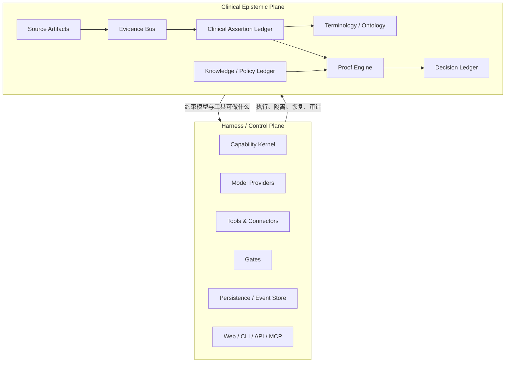

# Javert Clinical Evidence Backbone：架构探索与全球参照系

> 状态：探索稿 v0.1（不是已批准的技术规格）  
> 日期：2026-08-14  
> 目的：整理本轮讨论，形成与临床、产品、数据、合规及工程同事共同评审的起点。

## 0. 一句话结论

Javert 不应只被改造成“可以更换模型和工具的 Agent 框架”，而应成为一个 **Clinical-Native Harness**：下层提供可替换、可恢复、可审计的执行底座；上层维护患者事实、医学知识和系统决策之间完整、可追溯、可纠错的证据链。

它可以被概括为：

> **Javert = 医疗安全内核 + pi 的耐久编排 + DeepSeek Harness 的受控执行总线 + OpenConnector 的数据/凭据边界。**

但这里必须修正一个产品表述：系统不能承诺掌握“完整的临床真相”，只能承诺完整记录：**系统在某个时点知道了什么、来自哪里、如何解释、存在什么未知或冲突、依据哪个版本的医学知识作出了什么判断。**

## 1. 本轮讨论从哪里开始

最初的问题是：Javert 能否借鉴三个近期项目，逐步成为一个 standalone harness。

- [earendil-works/pi](https://github.com/earendil-works/pi)：借鉴耐久 Agent 生命周期、原生工具调用、运行状态和用量账本。
- [oomol-lab/open-connector](https://github.com/oomol-lab/open-connector)：借鉴声明式能力定义、schema、scope、凭据隔离、幂等和执行器分离。
- [deepseek-ai/deepseek-harness](https://github.com/deepseek-ai/deepseek-harness)：借鉴一切能力皆插件、服务缝隙、作用域注册、可逆副作用、追加式会话日志以及工具执行管线。

进一步讨论后，目标从“插件化现有审核应用”升级为：

1. 模型、工具、门控、存储、Web、数据接入和医学知识包都可替换。
2. 无论替换哪一种实现，都不能改变临床事实和决策的核心语义。
3. 每个结论都必须能沿着证据、事实、规则和执行记录回放。
4. 不确定、缺失、冲突、撤回和知识版本变化必须成为一等状态。
5. 这个“宪法”不能由产品经理和 AI 单独决定，必须由医学、药学、医保、病案/数据、隐私和工程共同制定。

## 2. 对 Javert 当前架构的判断

Javert 目前已经不是一张白纸。现有主链路大致是：

```text
患者数据
  -> Router
  -> 确定性 precheck
  -> LLM / 结构化评估
  -> verdict gate
  -> SQLite
  -> SQL Server
  -> review workbench
```

已有的重要安全资产包括 Promise、确定性预检、verdict gate、肿瘤用药四状态评估和 proof tree。尤其是以下代码已经包含 backbone 的种子：

- `src/javert/oncology/contracts.py`：`SATISFIED / NOT_SATISFIED / UNKNOWN / CONFLICT`、证据锚点、规范化事实、条件评估和证明节点。
- `src/javert/oncology/authoring/models.py`：来源文档、片段、校验和、修订版本和生效时间窗。
- `src/javert/oncology/eligibility.py`：条件 AST、证明树和 fail-closed 逻辑。
- `src/javert/audit/precheck.py`：确定性事实与证据锚点。

当前主要缺口不是“少几个插件”，而是执行、临床事实和医学知识尚未共享一套稳定契约：

- Agent 循环较集中，文本 `<tool_call>` 解析仍是关键路径；已有 tool schema 尚未真正成为模型调用与执行的统一边界。
- 工具执行器持有共享可变的患者上下文，难以清楚表达 scope、并发隔离和重放边界。
- 部分任务状态和 SSE 队列存在于进程内，重启后的执行恢复与结果投影并非同一套事实来源。
- 当前通用 `Evidence` 结构仍偏浅，不能完整表达主体、临床有效时间、记录时间、事实状态、术语版本、推导活动、冲突和撤回。
- 事实、知识、判断和运行日志虽都有局部实现，但尚未构成统一的、可验证的 provenance chain。

因此，不建议先做一次“大插件化重构”。正确顺序是先稳定语义契约，再让实现沿契约逐步替换。

## 3. 目标架构：两个平面、四本账、一个执行日志

### 3.1 两个相互正交的平面



- **Harness / Control Plane** 回答：谁可以执行、调用什么、在哪个作用域内、失败后如何恢复、如何审计。
- **Clinical Epistemic Plane** 回答：系统认为哪些临床命题成立、证据在哪里、采用什么医学语义、基于什么知识版本、为何得到这个判断。

### 3.2 四本账与一个日志

1. **Source Ledger**：原始病历、医嘱、检验、检查、指南、药品说明书等不可变来源及其版本、校验和和片段定位。
2. **Clinical Assertion Ledger**：患者级临床命题，以及观察、医生陈述、患者自述、模型抽取、规范化、否定、未知、冲突、撤回等状态。
3. **Knowledge Ledger**：指南、规则、政策、术语映射、适应证和禁忌证的版本、生效区间与适用范围。
4. **Decision Ledger**：候选判断、各门控结果、人工复核、最终结论、撤回或重算关系。
5. **Harness Execution Log**：模型、工具、插件、输入输出、批准、错误、重试、恢复和副作用的追加式记录。

核心追溯链应固定为：

```text
SourceArtifact
  -> EvidenceItem
  -> ClinicalAssertion
  -> NormalizedFact
  -> CriterionAssessment
  -> ProofNode
  -> Decision
```

每一条边都不是普通外键，而是一次有身份、有版本、有时间、有责任主体的 derivation / provenance 活动。

## 4. Backbone 的“宪法”是什么

宪法不是一份由技术人员写完后交给医生签字的架构文档。它是跨专业团队共同确认的 **不可破坏的不变量**，并且每一条都必须能转化为验收案例和自动测试。

可以被替换的是机制：模型、工具、术语服务、消息传输、数据库、Web、规则实现、医院适配器。不能被替换的是语义边界：

1. **身份与版本**：来源、事实、知识、决策和执行均有稳定身份与明确版本。
2. **证据边界**：任何临床事实必须指向具体来源片段；模型生成的解释不能倒置为来源证据。
3. **事实状态**：`UNKNOWN != FALSE`，没有证据不等于存在否定证据。
4. **时间语义**：至少区分临床有效时间与系统记录时间，并能表示迟到、修订和追溯录入。
5. **冲突与撤回**：新记录不能悄悄覆盖旧事实；必须用 supersede、contradict、retract 等关系表达。
6. **知识版本**：判断必须固定到当时使用的指南、政策、术语和映射版本。
7. **证明边界**：模型可以提出事实和判断候选，但不能直接写入最终医学结论。
8. **门控顺序**：强制门控不可缺席、不可绕过；失败时必须 fail closed 或进入人工复核。
9. **追加与回放**：最终状态应能从不可变事件重建，投影视图不是唯一事实源。
10. **PHI 边界**：插件声明最小数据权限、网络权限、副作用与保留策略；敏感数据默认不能跨边界。

一句工程原则：

> **替换机制，不替换语义；替换实现，不破坏不变量。**

每条宪法条款至少包含：不变量、正例、反例、失败行为、负责签署的角色和可执行测试。

## 5. Evidence Bus 与 Ontology 的关系

二者不能二选一，也不应混成一个模块：

- **Ontology / Terminology** 回答“这个事实是什么意思、与其他概念是什么关系”。
- **Evidence Bus** 回答“这个事实来自哪里、何时出现、经过谁或哪个算法处理、流向了哪里”。

FHIR 是资源和交换模型，不是完整的医学本体；SNOMED CT、LOINC、ICD 和医院本地码是不同用途的术语体系。Javert 内部应先采用轻量但版本化的引用：

```text
ConceptRef(system, code, version, display)
```

初期不必直接引入 Neo4j 或 OWL reasoner。可以先定义稳定的 semantic graph 接口，底层继续采用关系型数据库和事件存储，需要分析时再建立图投影。

Evidence Bus 也不等于一开始就部署 Kafka。它首先是一套带 schema 的逻辑协议，例如：

```text
source.ingested
evidence.observed
assertion.proposed
assertion.normalized
assertion.verified
assertion.contradicted
assertion.superseded
criterion.assessed
proof.completed
decision.proposed
gate.applied
decision.finalized
projection.published
```

事件至少携带：事件 ID、去标识化的患者/就诊引用、schema 版本、临床时间与系统时间、artifact/fragment 引用、生产者及模型/工具版本、校验和、PHI 分类、幂等键和 provenance。

建议的核心 `ClinicalAssertion` 至少包含：

```text
assertion_id
subject / encounter / episode
concept_ref
value / unit
polarity
epistemic_status
clinical_valid_time
recorded_time
evidence_refs
derivation_activity_id
terminology_mapping_version
supersedes / contradicts
privacy_classification
```

## 6. 插件不是“随便插”：能力、作用域与门控

插件类型可以包括：

- model-provider
- clinical-source-adapter
- tool / connector
- extractor / normalizer
- ontology-provider / knowledge-provider
- policy-pack
- gate
- event-store / projection
- web / CLI / API / MCP

每个插件 manifest 应声明：`id`、版本、提供与依赖的 capability、输入输出 schema、PHI 权限、网络权限、副作用、幂等与重放能力、确定性等级和兼容范围。生产插件应采用固定版本、签名或 allowlist；同时拥有 PHI、网络和写权限的非可信插件必须隔离执行。

Gate 只能返回结构化结果，例如：

```text
PASS | BLOCK | REVIEW | ABSTAIN
reason
evidence_refs
proof_refs
```

Gate 不能自行写最终结果。`DecisionFinalizer` 按既定策略归并各 gate，且强制 gate 缺失本身就是失败状态。

模型的角色是 **Derivation Agent**，而不是真相权威：它可以从来源提出 assertion、帮助概念规范化、提出证明候选；但必须经过 schema 校验、证据对齐、术语映射、确定性规则或人工复核。它不能制造无来源事实、把缺失当阴性、修改政策、绕过门控或直接持久化最终结论。

## 7. 全球有哪些相近机构和项目

公开世界里有很多项目分别覆盖了其中一层，但目前没有发现一个成熟、公开、广泛采用的系统，同时完成 **患者级证据账本 + 时间化临床事实 + 可计算知识 + 证明链 + 可替换 Agent Harness + 医疗门控**。这是基于以下公开资料作出的综合判断，不应宣传成“世界首创”。

| 机构 / 项目 | 它解决的核心问题 | 与 Javert 重合之处 | 相对目标仍缺少什么 | Javert 应如何借鉴 |
|---|---|---|---|---|
| [openEHR](https://specifications.openehr.org/) | 把临床领域语义从软件实现中分离，以 archetype/template 建模长期健康记录 | 临床模型、版本化记录、审计轨迹、领域专家治理 | 不是 Agent harness，也不负责模型/工具执行与医疗门控 | 学其“模型先于应用”、版本与治理；不要复制完整 EHR 平台 |
| [OHDSI / OMOP CDM](https://ohdsi.github.io/CommonDataModel/) | 跨机构标准化观察性健康数据和词表，支持真实世界证据研究 | 标准事实、词表映射、数据质量、可复现分析 | 通常是分析型标准化数据，不保存全部原始片段级 provenance，也不是在线决策 runtime | 把 OMOP 作为分析/研究投影和互通出口，不作为唯一事实源 |
| [HL7 FHIR Clinical Reasoning](https://fhir.hl7.org/fhir/clinicalreasoning-module.html)、[CQL](https://cql.hl7.org/)、[CPG-on-FHIR](https://hl7.org/fhir/uv/cpg/) | 互操作资源、可计算临床逻辑和指南知识工件 | 规则表达、知识工件、证据/计划/决策支持接口 | 不提供 Javert 所需的意见化执行内核、完整事件账本与插件隔离 | 对外采用 FHIR；中期支持 CQL/CPG 导入导出，不必让内部领域模型等于 FHIR |
| [W3C PROV-O](https://www.w3.org/TR/prov-o/) 与 [FHIR Provenance](https://hl7.org/fhir/provenance.html) | 描述实体、活动、代理与资源生命周期的来源关系 | 来源、推导、责任主体、数字签名与审计 | 是表达标准，不是临床事实系统和执行引擎 | 让内部 provenance 能无损映射到这些标准 |
| Stanford BMIR / [Protégé](https://protege.stanford.edu/) / [BioPortal](https://bioportal.bioontology.org/) | 医学本体的创作、协作、版本和推理工具 | 概念治理、协作建模、术语/本体服务 | 不管理患者证据、判断证明和 Agent 执行 | 需要复杂本体协作时集成，不在 Javert 内重造本体编辑器 |
| University of Michigan Knowledge Systems Lab / [Knowledge Grid](https://kgrid.org/) | 将规则、模型、表型、算法等可计算生物医学知识封装为带元数据和稳定 ID 的 Knowledge Object 并激活运行 | 与 policy-pack、knowledge-provider、可替换医学知识插件高度接近 | 不以患者来源/事实账本和全过程医疗审核为中心 | 重点借鉴知识包 manifest、版本、依赖、激活和发布治理 |
| AHRQ / MITRE [CDS Connect](https://digital.ahrq.gov/health-it-tools-and-resources/clinical-decision-support-cds/) | 多学科协作开发、发布和复用临床决策支持知识工件 | 医生、术语专家和开发者共同把指南变成 CQL，并进行自动测试 | 不是通用 Agent backbone；原 AHRQ 工具已在 2025 年下线并转向社区延续 | 借鉴其跨专业 authoring 和验证流程，而不是绑定旧平台 |
| [FastOMOP](https://arxiv.org/abs/2604.24572)（2026 预印本） | 在 OMOP 上把治理、可观察性和编排同可插拔 Agent team 分离，以确定性边界控制 RWE 生成 | 与“模型可换、门控不可绕过、执行可审计”非常接近 | 面向队列研究和 RWE，不是病人级临床事实/决策 backbone；成熟度仍待验证 | 作为最接近的近期架构信号跟踪，尤其关注 process-boundary governance |
| [HEG-TKG](https://arxiv.org/abs/2604.17114)（2026 预印本） | 用可追溯、时间化知识图谱减少临床 AI 的引用与证据鸿沟 | 时间化证据图、claim-level citation、冲突可检测 | 聚焦罕见病知识与文献证据，不是医院患者事实和通用执行 runtime | 证明“证据可验证性不能只靠 RAG 或 LLM judge”，值得用于评估设计 |

另外三个原始参照项目处在“通用 Agent 基础设施”一侧：

| 项目 | 应吸收的机制 | 不应直接照搬的部分 |
|---|---|---|
| pi | typed lifecycle、原生工具、持久 operation state、effect sandwich、崩溃恢复、用量账本 | 完整聊天产品/session tree、默认允许的无限扩展能力 |
| OpenConnector | `ActionDefinition`、schema、scope、credential、idempotency、definition/executor 分离、发现接口 | 先追求上千 SaaS 连接器和通用 OAuth 市场 |
| DeepSeek Harness | capability/service seam、scoped registration、reversible effects、追加式 session event、工具 pre/post/finalize 管线、审批 fail-closed、sandbox | 当前仍快速变化的具体 API；应借其边界，而不是绑定其实现 |

### 7.1 最重要的行业判断

这些组织其实代表六种不同传统：

1. openEHR：临床语义和长期记录治理。
2. OHDSI：分析标准化与真实世界证据网络。
3. HL7：互操作、可计算指南和决策支持接口。
4. Stanford BMIR：本体工程。
5. Michigan KGrid / CDS Connect：可计算医学知识的封装与共同生产。
6. pi / DeepSeek / OpenConnector：现代 Agent 执行、插件和连接器边界。

Javert 的机会不是替代其中任何一个，而是把这些传统在 **患者级、可追溯的医疗判断执行链** 上组合起来。其差异化可以表述为：

> **A governed clinical evidence harness that turns source-bound patient facts and versioned medical knowledge into replayable, reviewable decisions.**

更直白地说：Javert 不做另一个 EHR、不做另一个 OMOP、不做另一个 ontology editor，也不做医疗版通用聊天机器人；它做这些系统之间“从证据到判断”的受控骨架。

## 8. 这件事必须怎样与医学同事共同完成

产品经理负责边界和工作流，AI/工程负责把共识变成契约、测试和实现；临床语义和可接受风险必须由有资质的人类专家签署。

建议建立一个小型 **Clinical Backbone Working Group**：

- 产品负责人：场景、优先级、用户流程和最终取舍记录。
- 临床负责人：临床事实语义、证据充分性、不确定性和人工复核边界。
- 临床药师 / 医保专家：药品限制、政策适用域、例外和版本变化。
- 病案 / 临床数据 / 医院 IT：真实数据来源、字段含义、迟到与纠错模式。
- 隐私与安全负责人：PHI、最小权限、留存、跨境/跨机构边界。
- 技术架构与 AI：schema、事件、插件协议、回放、测试和实现。

不要请医生设计 class、数据库或 ontology。应给他们脱敏的真实病例和非常具体的问题：

- 这句话是在陈述事实、否定事实，还是表达怀疑？
- 如果检验结果晚于医嘱录入，哪个时间决定规则适用？
- 两份病历冲突时可以自动裁决吗？必须展示哪些原文？
- 什么情况下只能返回 UNKNOWN 或 REVIEW？
- 哪些结论必须由药师或医生签署？

共同生产的路径应是：

```text
脱敏病例
  -> 临床判断与分歧
  -> Decision Record
  -> 领域契约与不变量
  -> Schema / Gate / Policy
  -> Golden Tests
  -> Shadow Run
  -> 临床复核差异
```

建议用四次工作坊形成 v0.1：

1. **来源与事实**：列出权威来源、事实类型、证据锚点和来源优先级。
2. **时间、否定与冲突**：定义有效时间、记录时间、UNKNOWN、显式阴性、冲突、撤回。
3. **知识与证明**：定义政策版本、适用范围、规则节点、最小充分证据和人工复核。
4. **自动化与治理**：决定模型和工具权限、强制门控、变更审批、回放和上线准入。

“宪法”初稿建议包含十章：认识论；来源与证据；临床命题；时间；术语和映射；冲突与证据等级；证明与决策；Harness 与插件；隐私安全；变更治理。

## 9. 可实施的迁移路线

### 阶段 0：先冻结语义，不重写系统

- 选择一个垂直切片，优先建议“肿瘤药物适用性”，因为现有四状态与 proof tree 已有基础。
- 用 20–30 个脱敏病例完成术语、事实状态、时间、证据充分性和门控的共同定义。
- 形成 constitution、ADR、schema 和 golden cases。

### 阶段 1：旁路建立 Evidence Bus

- 保留现有 verdict 行为不变。
- 同时产出结构化 source、evidence、assertion、proof 和 decision events。
- 将旧结果视为 projection，与新账本做差异对照。

### 阶段 2：抽出 Harness Kernel

- capability registry 与插件 manifest。
- native tool schema 和统一执行 pipeline。
- durable attempt/session log、幂等、重试、恢复和副作用边界。
- model、tool、gate、event store 首先各实现两种可替换适配器，证明接口不是纸面抽象。

### 阶段 3：规则族逐步 proof-first

- 先迁移 M1/precheck，再迁移肿瘤药品，然后扩展到其他药品和规则族。
- 每次迁移都要求旧结果对照、证据完整率、UNKNOWN/CONFLICT 正确率和人工复核可理解性。

### 阶段 4：形成三层发行物

- **Javert Kernel**：无医疗语义的受控执行内核。
- **Javert Clinical Backbone**：证据、事实、知识、证明和决策契约。
- **Javert Audit Distribution**：医保审核规则、医院适配器和复核工作台。

同时提供 headless、API 和 Web profile；Web 只是一个 projection，不拥有领域真相。

## 10. v0.1 的成功标准

第一版不以“支持多少模型、多少插件”为成功标准，而以以下问题能否被验证为准：

- 20–30 个脱敏病例的每个关键判断都能定位到原始来源片段。
- 能稳定区分显式阴性、缺失、未知、冲突和撤回。
- 能同时表达临床有效时间和系统记录时间。
- 每个判断固定到知识、术语和插件版本，并可重放。
- 更换模型、Web 或存储后，临床语义和强制门控不变。
- 临床复核者可在两分钟内理解主要证明链并找到原文。
- 失败恢复不会重复外部副作用，也不会产生“模型看到了但日志没有”的隐藏上下文。
- 最终决策不依赖无法验证的隐藏思维过程，只依赖可检查的事实、规则、证据和 gate 结果。

## 11. 仍需共同回答的问题

1. Javert 的首要产品身份是医保审核 backbone、院内临床决策 backbone，还是通用临床证据基础设施？三者风险与监管边界不同。
2. 患者事实 ledger 的法定/业务权威是什么：原始 HIS/EMR、Javert 派生记录，还是二者之间的明确映射？
3. 哪些事实允许模型提出后自动确认，哪些必须由确定性算法或人工确认？
4. 冲突证据的优先级是否能全局定义，还是必须按临床域和场景定义？
5. 哪些知识包属于医学指南，哪些属于医保政策，哪些属于医院内部规则？它们的签署人和更新 SLA 是什么？
6. 需要保留多长时间的原始片段、模型输入输出和完整执行日志？
7. 对外互操作优先采用 FHIR、openEHR、OMOP 中哪一种投影，取决于首批医院现状，而不应由架构偏好决定。

## 12. 当前建议

不要立即以“全面重构”为项目启动语。先以一个架构型 OpenSpec change（建议名：`define-clinical-evidence-backbone`）组织共识，只产出 proposal、design、领域规格、工作坊材料和 golden case 模板；经临床工作组签署 v0.1 后，再拆分实现 change。

参照体系建议按以下优先级组合：

1. 用 **openEHR 的哲学**建立临床模型与治理，而不是复制其全栈。
2. 用 **W3C PROV / FHIR Provenance**校准来源和推导表达。
3. 用 **HL7 CQL / CPG**校准可计算知识和对外互操作。
4. 用 **Knowledge Grid**的思路封装可替换、可版本化的医学知识包。
5. 用 **pi / DeepSeek Harness / OpenConnector**的机制实现耐久运行、能力隔离和连接器边界。
6. 把 **OMOP**作为研究、统计和跨机构分析投影，而不是患者事实的唯一 source of truth。

这条路线允许 Javert 保留今天已经工作的审核能力，同时逐步长成 backbone，而不是为了追赶热门框架而先失去自己的临床资产。

